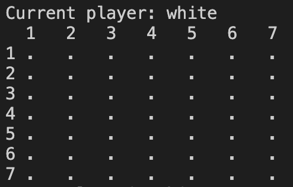
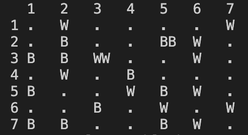
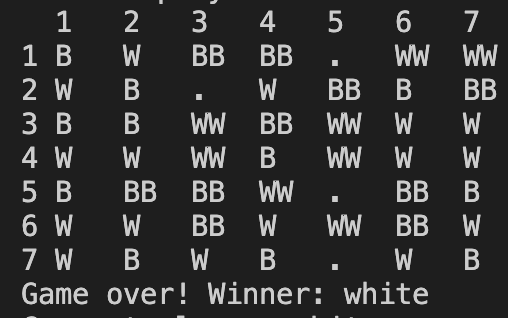

# PFL TP2 2024-2025

## The Topic and Group Identification

This group (LOT_1) is constituted by, and each member's respective contribution is:

- Alexandre António Pinho da Silva - 47.5%

- Eduardo Ferreira Baltazar - 47.5%

- Sofia Alexandra Mesquita Carvalho de Sousa - 5%


Even though our group is of 3 people, we were not able to fully implement the features specific to this group size, as one of the members did not contribute to the coding part of the project, only having contributed towards this Readme file.

Our group's chosen game was LOT.

## Instalation and Execution

In addition to the the installation of SICStus Prolog 4.9, there is no other installation to be done.

To run the project simply run:

```
sicstus -l src/game.pl
```

To play the game, one should use the play/0 predicate (`play.`).

## Game Description

We used the rules from the official website, available at https://nestorgames.com/rulebooks/LOT_EN.pdf

LOT is played on an orthogonal grid of 7 x 7 squares.
Two players, black and white, struggle to create a line of
three consecutive stacks of 2 pieces each in any direction (orthogonal or diagonal).

Players alternate turns during the game until one of
them reaches the victory condition.

On your turn, do the following in order:
1. Lay out a thing on an empty lot: Place a piece
of your colour on an empty space of the board.
2. Look over that: If at least one line of three or
more consecutive pieces (not stacks) in any direc-
tion (orthogonally or diagonally) of your colour has
been created then you must do the following in or-
der:
a. Choose one of the lines of three that have
been created and remove two pieces, but
leave one there.
b. Add one level of tower, by adding another
piece of yours to the one you left there,
making it a stack.


If, at the end of the turn, at least one line of three (or
more) consecutive stacks of the same colour has been
created, the line’s owner triumphs. If the board fills up
before this happens the game ends in a draw.

## Considerations For Game Extensions

The game can be played on different sized boards, and this is available to users when starting the game. They are given the choice between playing with the default board size, or a size of their choice.

This game's rules are so simple that it would be hard to simplify them without loosing the interest of the game. But, if one wanted to do this, the rule of 3 pieces create a stack could be changed to 2 pieces create a stack.

To make the game harder, one could do the opposite, to make the pieces to make a stack larger than 3. Or even, make the win condition stacks 3 high, instead of 2 high.

## Game Logic

To test the game, you can use the following included predicates:

```
start_intermediate_state_1.
start_intermediate_state_2
start_near_final_state
```

### Game Configuration Representation

To represent the game configuration, we simply have the board size, which is usually 7 for this game.

### Internal Game State Representation

To represent the game internally, we use a GameState and a MatchState. The GameState is composed by the current board and the current player. The current board is a a list with X sublists, who have X items, with X being the size of the board. Each item can be an empty space, a white piece, a black piece, or a stack of white or black pieces. The current player is either white, or black.  The initial_state/2 predicate takes a GameConfig, which is just the size of the board, and it "returns" a GameState, of the type we have previously mentioned. The MatchState is a tuple of (Current Player, Player 1 Type, Player 2 Type), with the player type taking the value of human, easy_ai, medium_ai or hard_ai. 

Initial game state:



Intermediate game state:



Final game state:



### Move Representation

A move in the game is represented as a tuple ((Row,Col),MoveType,PieRuleFlag), where (Row,Col) specifies the board coordinates for the move, MoveType indicates whether the move involves placing a single piece (no_stack) or stacking pieces (StackMove), and PieRuleFlag denotes whether the pie rule is applied (pie_rule) or not (no_pie_rule). The move/3 predicate uses this representation to transition the game state by validating the move's legality, updating the board, and determining the next player. For standard moves, a piece is placed at the specified coordinates, and for stacking moves, additional validations and updates are performed to build the stack. If the pie rule is invoked, the current player's color is swapped, and a piece is placed using the new color. This structured representation ensures clarity and flexibility in handling different move types and game rules.

### User Interaction

The game features a menu-driven system to guide the user through various options, such as starting a new game, choosing options, making moves, or exiting the application. Interaction with the user is handled via prompts and text-based input, ensuring clarity and ease of use. Input validation is a key aspect, particularly when reading moves; the system checks for valid formats, ensures the inputs are within the bounds of the board, and verifies that the move adheres to the game's rules. Invalid inputs trigger descriptive error messages, prompting the user to re-enter their choices until valid input is provided, thereby maintaining a smooth and error-free gameplay experience.

## Conclusions

Our interpretation of the pie rule is that the second player (black) may choose to swap colours to white. After doing this, he places a white piece. But this rule is open to interpretation, and another interpretation could be that after choosing to swap colour, he skips this turn.

The minimax algorithm was not fully implemented, as it did not correctly work. There probably was a small error that we could not find.

This project still has some rough edges, and is not completely error-ridden. Some of the known bugs are:
- Diagonals of stacks that go from bottom to up, left to right, are not detected as win conditions.
- Sometimes the game crashes with wrong input
- In the easy mode, the plays do not seem completely random, but the reason for this seems oblivious to us.

In the future, a better algorithm could be implemented for a higher level of AI (minimax), and alternative rules could also be implemented.

## Bibliography

The only bibliography used for this project were the game rules, which are linked above in the Game Description section.

We also artificial intelligence, namely ChatGPT for bug finding and solving, and sometimes to better understand some abstract concepts inherent to the game and to the Prolog. We do not include here the prompts that were used, as it would make this document longer than it is required to be (4 pages).

